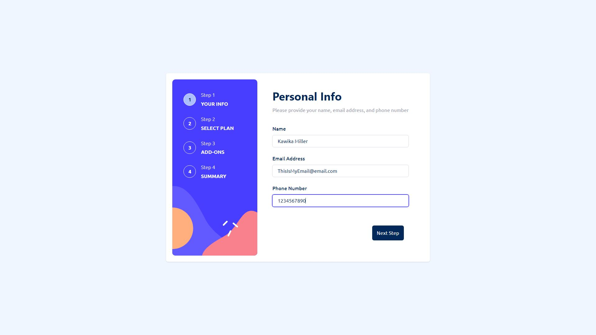
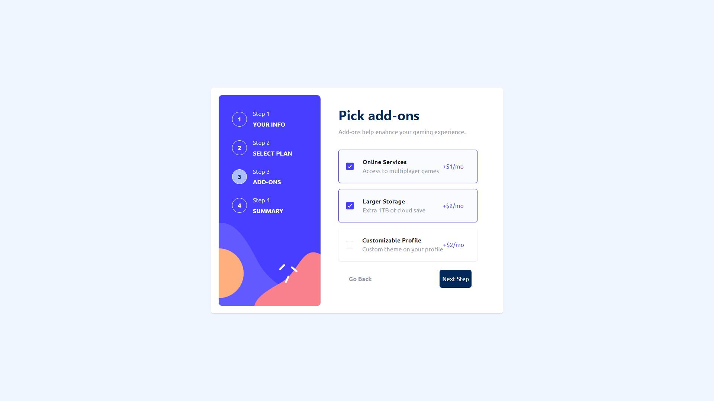
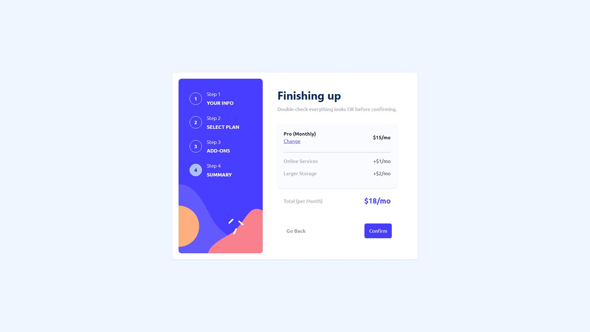
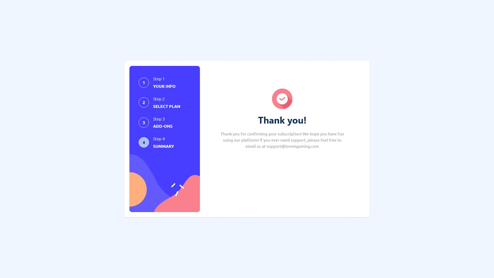
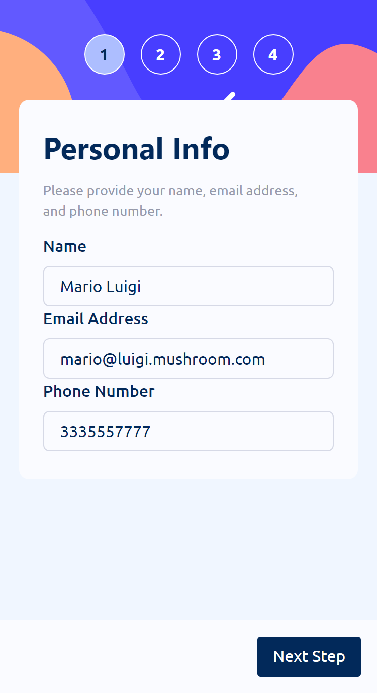
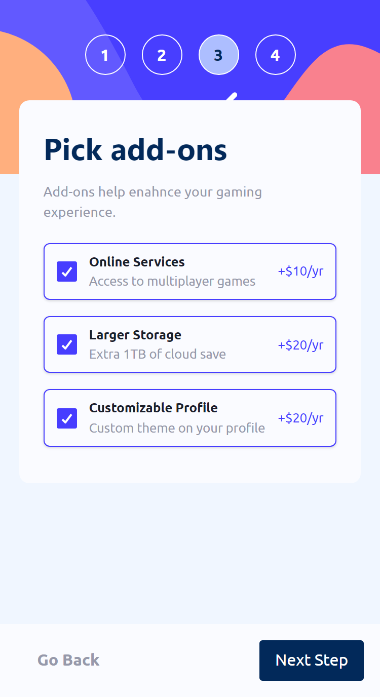
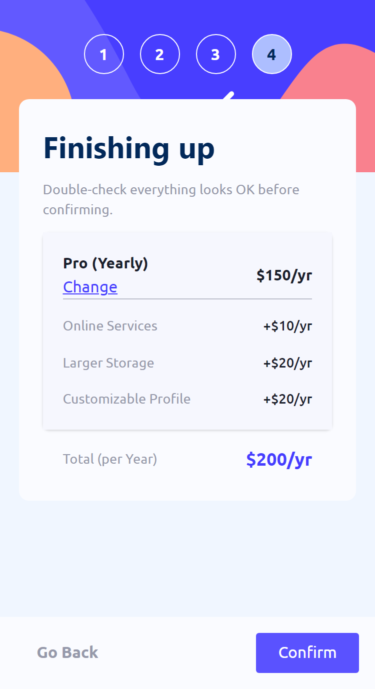
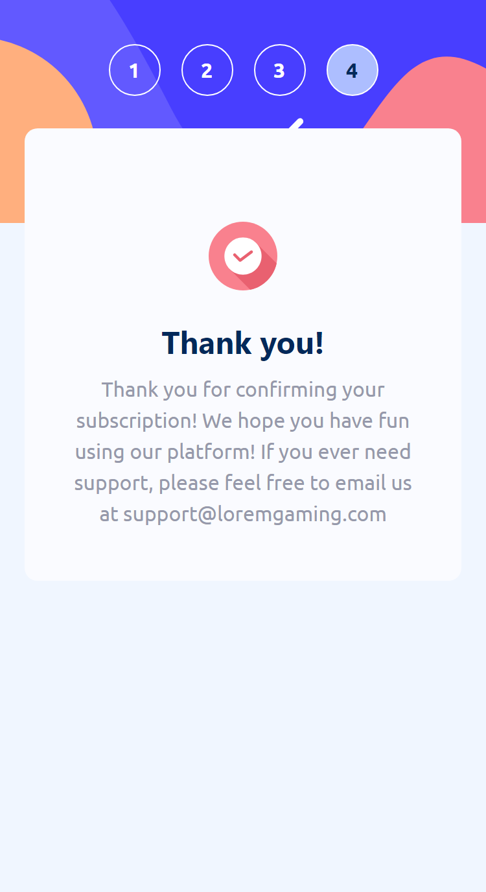

# Overview

I wanted to really test my limits as a front end developer with this project. It is a responsively-designed, multi-step form and I tried to put everything that I currently know about front end development to work. There are a few things that could use some polish/adjusting but as of right now I feel pretty comfortable with this in it's MVP (minimum viable product) state. If you have any comments, questions, or feedback please feel free to contact me! 

## Screenshots

  
Desktop Screenshots

  
  
  
  
  

  
Mobile Screenshots

  
  
  
  
  

## Links

- [Solution(Frontend Mentor)]()
- [Live Site](https://kmartwork.github.io/multi-step-form/)

# My Process

This was the first time that I've ever built a multi-step form so I spent a little time formulating a gameplan before I dived in to the actual work.

Normally, on a single-page form, we can use `event.target.<input_id>.value` to get the information from the various `<input>`'s of a form. But, since I knew that this wasn't going to be a traditional `<form>`, I knew I was going to need to store all of the various `<input>` values somewhere else so that I would still have access to those values in case I wanted to go back and make any changes.

I decided that this was a great opportunity to use Redux Toolkit for my state management. All the various inputs would have their values stored in a `slice` and then I could create & invoke various reducer functions when I needed to update their values on input change.

Since all of the input values are being stored in redux, I have access to them and can use those values if the user ever decided to `Go Back` - this way they have a visual confirmation that the data they input in previous form sections is still there.

I knew that I had a handful of UI libraries that I could choose but I decided to go with Chakra-UI once again because I don't have much experience with it and I wanted to get some more practice with it.

After that, it was just a lot of playing around with the components and styling to try and get each screen to match the design screenshots. I also wanted to challenge myself and get a little more practice using SASS so I decided to use that as well - although I'm sure I could have written my `scss` files a little better in order to take full advantage of the powers of SASS.

I also made the mistake of creating the desktop version of the form before I created the mobile version but in the end I was able to figure it all out and get a solid MVP!

## Built With
- React
- Redux Toolkit
- Chakra-UI
- SASS

## Author
- Kawika Miller