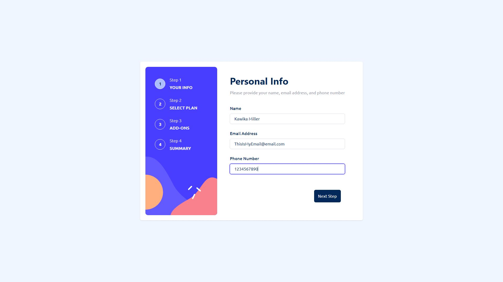
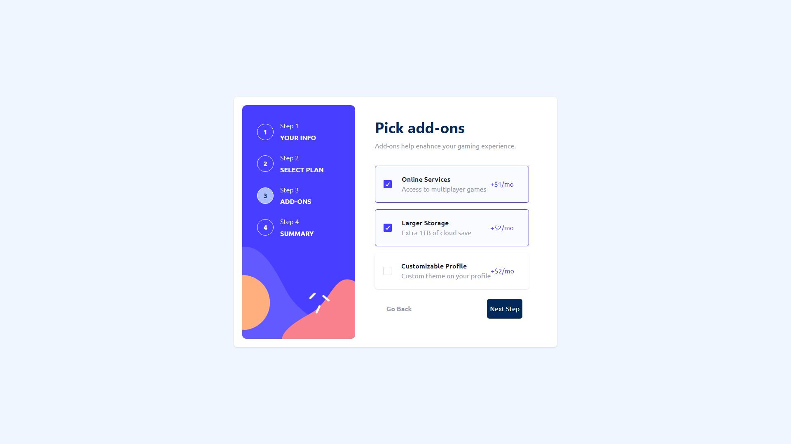
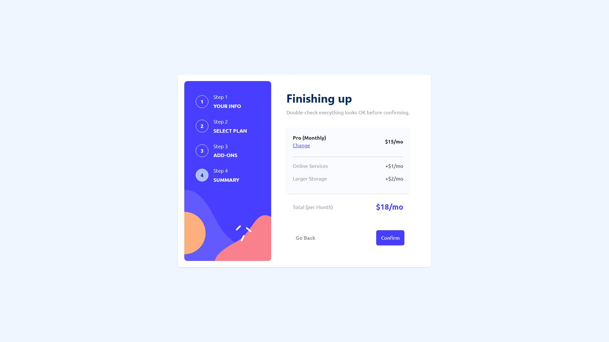
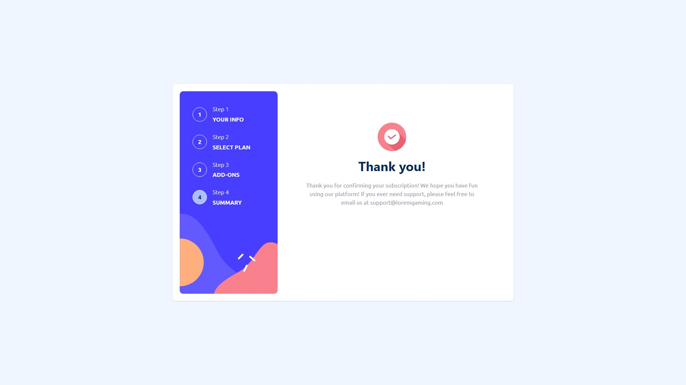
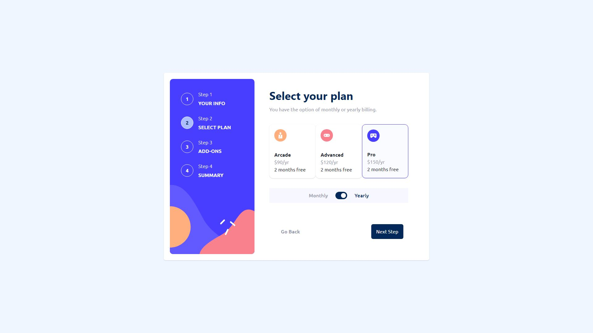

# Overview

I wanted to really test my limits as a front end developer with this project. It is a responsively-designed, multi-step form and I tried to put everything that I currently know about front end development to work. There are a few things that could use some polish/adjusting but as of right now I feel pretty comfortable with this in it's MVP (minimum viable product) state. If you have any comments, questions, or feedback please feel free to contact me! 

## Screenshots

  
Desktop Screenshots

  
  
  
  
  

  
Mobile Screenshots

  
  
  
  
  

## Links

# My Process

## Built With

## Author